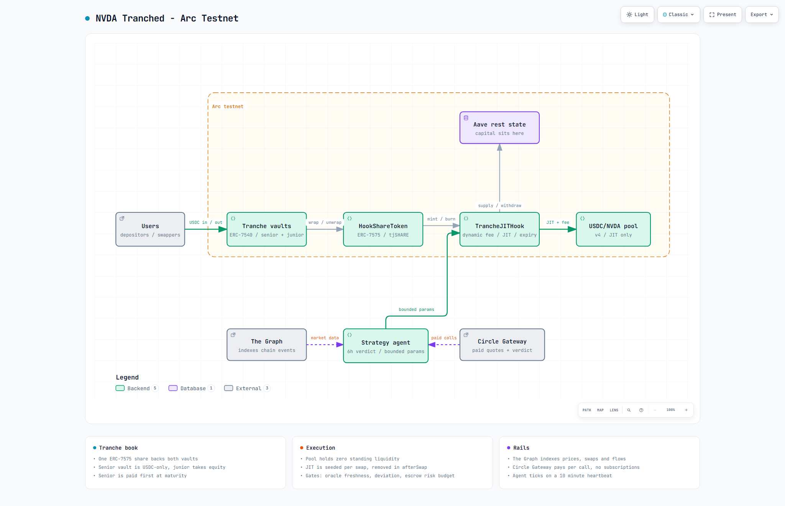

# NVDA Tranched Platform — `nvda-tranched-arc`

Stablecoin-native RWA capital structuring on **Arc Testnet**: NVDA exposure split into
Senior (fixed 5% target) and Junior (leveraged) tranches, with capital resting in a
lending market and a defensive Uniswap v4 JIT hook executing only in `+EV`, market-open,
oracle-valid windows under an agent-operated strategy controller.

**Live:** https://aadithkl.github.io/nvda-tranched-arc/ · **Addresses:** `docs/DEPLOYMENTS.md` ·
**Interface pack:** `deployments/arc-testnet.json`, `docs/abis/`, `examples/`

### What's live

- **Price rail** — x402 stock quotes bought with USDC on Arc (Circle Gateway nanopayments) push the
  onchain NVDA/USD oracle; the v4 AMM price is the second, independent reference. No Chainlink.
- **Tranche book** — `TrancheJITHook` (dynamic fee, toxic-flow pricing, bucket-exact JIT, Aave rest)
  plus ERC-7540 Senior/Junior vaults, an ERC-7575 hook share and `TrancheAccountant` settlement;
  one `EXPIRY_TIMESTAMP` per book stops quoting and freezes terminal redemption rates.
- **Agent** — bounded `StrategyController` with a 6h paid LLM verdict, deterministic clamps and
  per-swap onchain gates; hosted heartbeat every 10 minutes.
- **Reads** — the `tranch-stock` subgraph indexes oracle, pools, hook quotes/JIT, strategy
  submissions and tranche events for the app and the agent.

## Quickstart

```shell
forge build && npm install
cp .env.example .env          # secrets + addresses (never committed)
npm run agent:tick            # dry-run one agent tick (no tx)
npm run lending:status        # Aave semi-fork state
npm run hook:demo -- --status # live TrancheJITHook state
npm run export:pack           # regenerate ABIs + deployment manifest
```

Full script list in `package.json`; pinned dependencies and build flags in
[`REQUIREMENTS.md`](REQUIREMENTS.md).

## Architecture



Interactive, self-contained maps: [system architecture](docs/archify/nvda-tranches.architecture.html) and
[deposit to JIT swap](docs/archify/nvda-deposit-jit.sequence.html) - also hosted on the
[Pages site](https://aadithkl.github.io/nvda-tranched-arc/archify/nvda-tranches.architecture.html).
Code pointers and integration notes: [`docs/ARCHITECTURE.md`](docs/ARCHITECTURE.md). Diagrams are
generated with Archify from the typed JSON sources in `docs/archify/`.

## Uniswap v4 integration

The canonical Uniswap v4 contracts are used unmodified (pinned submodules) and redeployed on Arc
testnet, because Arc has no canonical v4 deployment. The tranche hook is the integration point —
verifiable at the lines below.

| Piece | Source |
|---|---|
| Hook permissions (`beforeSwap` + `afterSwap`) | [`TrancheJITHook.sol:207`](src/hook/TrancheJITHook.sol#L207) |
| `beforeSwap` entry / quote gates | [`TrancheJITHook.sol:844`](src/hook/TrancheJITHook.sol#L844) / [`493`](src/hook/TrancheJITHook.sol#L493) |
| Dynamic fee (deviation × toxicity, EV floor) | [`TrancheJITHook.sol:768`](src/hook/TrancheJITHook.sol#L768) |
| JIT one-sided position | [`_jitBeforeSwap:500`](src/hook/TrancheJITHook.sol#L500) / [`_jitAfterSwap:555`](src/hook/TrancheJITHook.sol#L555) / [`_sizeJit:615`](src/hook/TrancheJITHook.sol#L615) |
| `afterSwap` entry | [`TrancheJITHook.sol:860`](src/hook/TrancheJITHook.sol#L860) |
| Pool init / active pool | [`340`](src/hook/TrancheJITHook.sol#L340) / [`347`](src/hook/TrancheJITHook.sol#L347) |
| Swap entry (`swapExactIn`) | [`DemoRouter.sol:59`](src/router/DemoRouter.sol#L59) |
| v4 deployment (`new PoolManager`) | [`DeployV4Stack.s.sol:40`](script/DeployV4Stack.s.sol#L40) |
| Live addresses | `docs/DEPLOYMENTS.md`, `deployments/arc-testnet.json` |

Developer feedback: [`FEEDBACK.md`](FEEDBACK.md).

## The Graph integration

- **Subgraph:** `tranch-stock` indexes the oracle, v4 pools, hook quotes/JIT, strategy submissions
  and tranche events — entities and queries in [`docs/GRAPH.md`](docs/GRAPH.md).
- **Agent decisions:** `agent/market.mjs` pulls 336h hourly + 30d daily pool data through the
  gateway and computes volatility, fee capture and the fee-vs-IL sweep that drives quoting and
  rebalancing — [`docs/AGENT_MARKET.md`](docs/AGENT_MARKET.md).
- **Cross-protocol MCP:** the same Messari `vaults` query runs against this subgraph and live yield
  subgraphs — [`docs/MCP.md`](docs/MCP.md).
- **Verify:** `npm run graph:query` and `npm run market`.

## Hosting (GitHub Actions)

- **Frontend:** every push to `main` builds `frontend/` and deploys to GitHub Pages —
  [`.github/workflows/pages.yml`](.github/workflows/pages.yml).
- **Agent heartbeat:** cron every 10 minutes runs one tick (`--submit` when the regime changes or
  the params TTL lapses) and refreshes the paid LLM verdict every 6h —
  [`.github/workflows/agent-heartbeat.yml`](.github/workflows/agent-heartbeat.yml).

## Docs

[`docs/ARCHITECTURE.md`](docs/ARCHITECTURE.md) — code map + flows ·
[`docs/HOOK.md`](docs/HOOK.md) — hook modules, quote flow, TTL, maturity ·
[`docs/ACCOUNTANT.md`](docs/ACCOUNTANT.md) — claims, waterfalls, settlement ·
[`docs/LENDING.md`](docs/LENDING.md) — Aave semi-fork ·
[`docs/PRICE_SOURCES.md`](docs/PRICE_SOURCES.md) — oracle design ·
[`docs/CIRCLE.md`](docs/CIRCLE.md) — Circle/Gateway integration ·
[`docs/FRONTEND_INTEGRATION.md`](docs/FRONTEND_INTEGRATION.md) — app wiring ·
[`agent/README.md`](agent/README.md) — agent daemon.

## License

MIT — see [`LICENSE`](LICENSE); third-party scope (incl. the Uniswap v4 BUSL-1.1 testnet note) in
[`LICENSES.md`](LICENSES.md).
