# Architecture

Diagrams are authored in Mermaid (`docs/diagrams/*.mmd`), exported to SVG (`docs/assets/*.svg`,
regenerate with `npm run diagrams:export`), and embedded below. Contracts and scripts are linked with
line numbers so reviewers can verify each claim in the source.

Addresses are never embedded in this document. Read them from `deployments/arc-testnet.json`
(regenerated by `npm run export:pack`).

---

## 1. System overview


| Layer | Component | Responsibility | Source |
|---|---|---|---|
| Apps | Frontend | Vaults / Price / Strategy / Markets pages; injected wallet or Circle passkey smart account with `paymaster: true` | `frontend/src/main.ts`, `frontend/src/wallet.ts` |
| Apps | Agent daemon | Tick loop: perceive → economic audit → submit params / rebalance; owns the oracle price rail | `agent/index.mjs`, `agent/model.mjs` |
| Apps | Agent HTTP bridge | `POST /tick`, `GET /health` for the frontend "Run agent check" button | `agent/serve.mjs` |
| Apps | Heartbeat | GitHub Actions cron (every 10 min) runs the tick and refreshes the paid verdict | `.github/workflows/agent-heartbeat.yml` |
| Tranche core | `TrancheJITHook` | Dynamic fee, quote gates, bucket-exact JIT, Aave rest state, one-shot expiry | `src/hook/TrancheJITHook.sol` |
| Tranche core | `HookShareToken` | ERC-7575 share for the hook strategy receipt (mint/burn by hook only) | `src/core/HookShareToken.sol` |
| Tranche core | `TranchePipeModule` | Dual-token exits, venue rebalancing, maturity settlement waterfall | `src/periphery/TranchePipeModule.sol` |
| Tranche core | `SeniorVault` / `JuniorVault` | ERC-7540 async vaults over the hook share; senior USDC-only exits | `src/vaults/SeniorVault.sol`, `src/vaults/JuniorVault.sol`, `src/vaults/TrancheVault.sol` |
| Tranche core | `TrancheAccountant` | Senior/junior entitlements, escrow, senior-priority keeper, frozen settlement credits | `src/vaults/TrancheAccountant.sol` |
| Tranche core | `StrategyController` / `StrategyAgent` | Hard bounds for the operator key; agent can only reshape activity within caps | `src/strategy/StrategyController.sol`, `src/strategy/StrategyAgent.sol` |
| Markets | Uniswap v4 instance | Canonical v4-core + v4-periphery code (pinned submodules, unmodified) redeployed on Arc testnet; `DemoRouter` is ours | `lib/v4-core`, `lib/v4-periphery`, `src/router/DemoRouter.sol` |
| Markets | Aave V2 semi-fork | Rest state: USDC + NVDA markets, aTokens, pegged oracle; independent implementation (no upstream code copied) | `src/lending/` |
| Markets | `NVDAPriceOracle` | x402-pushed NVDA/USD price; gates hook quoting and lending pegs | `src/oracle/NVDAPriceOracle.sol` |
| External | The Graph | `tranch-stock` subgraph indexes oracle, pools, hook, strategy and tranche events; gateway powers the market model and the frontend Markets page | `subgraph/`, `agent/graph.mjs` |
| External | Circle Gateway | Nanopayments for oracle price purchases and paid agent reasoning | `agent/price.mjs` |
| External | agent402 / BlockRun | Paid LLM strategy manager (6h) and NVDA stock quote sellers | `agent/refresh.mjs`, `scripts/x402-ai.mjs` |

### Code map (entry points)

| Contract | Key functions | Lines |
|---|---|---|
| `TrancheJITHook` | `setExpiry` / `expired` | [`301`](../src/hook/TrancheJITHook.sol#L301) / [`308`](../src/hook/TrancheJITHook.sol#L308) |
| | `effectiveMaxDeploy` / `_quoteWithGates` | [`400`](../src/hook/TrancheJITHook.sol#L400) / [`493`](../src/hook/TrancheJITHook.sol#L493) |
| | `_jitBeforeSwap` / `_jitAfterSwap` / `_sizeJit` | [`500`](../src/hook/TrancheJITHook.sol#L500) / [`555`](../src/hook/TrancheJITHook.sol#L555) / [`615`](../src/hook/TrancheJITHook.sol#L615) |
| | `wrapUSDC` / `unwrapUSDC` | [`450`](../src/hook/TrancheJITHook.sol#L450) / [`463`](../src/hook/TrancheJITHook.sol#L463) |
| | `_beforeSwap` / `_afterSwap` (IHooks entry) | [`844`](../src/hook/TrancheJITHook.sol#L844) / [`860`](../src/hook/TrancheJITHook.sol#L860) |
| `TranchePipeModule` | `wrapUSDC` / `unwrapUSDC` | [`173`](../src/periphery/TranchePipeModule.sol#L173) / [`187`](../src/periphery/TranchePipeModule.sol#L187) |
| | `unwrapEquity` / `unwrapProportional` | [`201`](../src/periphery/TranchePipeModule.sol#L201) / [`217`](../src/periphery/TranchePipeModule.sol#L217) |
| | `rebalanceSwap` / `settleSwap` | [`245`](../src/periphery/TranchePipeModule.sol#L245) / [`289`](../src/periphery/TranchePipeModule.sol#L289) |
| | `finalizeSettlement` / `finalizeSettlementHaircut` | [`319`](../src/periphery/TranchePipeModule.sol#L319) / [`325`](../src/periphery/TranchePipeModule.sol#L325) |
| `TrancheVault` | `depositUSDC` / `requestRedeem` | [`166`](../src/vaults/TrancheVault.sol#L166) / [`366`](../src/vaults/TrancheVault.sol#L366) |
| | `fulfillRedeem` / `_withdraw` | [`153`](../src/vaults/TrancheVault.sol#L153) / [`214`](../src/vaults/TrancheVault.sol#L214) |
| | `creditSettlement` / `redeemAtExpiry` | [`247`](../src/vaults/TrancheVault.sol#L247) / [`261`](../src/vaults/TrancheVault.sol#L261) |
| | `claimAndUnwrapUSDC` / `claimAndUnwrapEquity` / `claimAndUnwrapProportional` | [`291`](../src/vaults/TrancheVault.sol#L291) / [`310`](../src/vaults/TrancheVault.sol#L310) / [`330`](../src/vaults/TrancheVault.sol#L330) |
| `TrancheAccountant` | `seniorClaim` / `juniorClaim` / `escrowFunded` | [`148`](../src/vaults/TrancheAccountant.sol#L148) / [`154`](../src/vaults/TrancheAccountant.sol#L154) / [`158`](../src/vaults/TrancheAccountant.sol#L158) |
| | `rebalance` / `fulfillRedeem` / `seniorGuaranteeUsdc` | [`162`](../src/vaults/TrancheAccountant.sol#L162) / [`193`](../src/vaults/TrancheAccountant.sol#L193) / [`221`](../src/vaults/TrancheAccountant.sol#L221) |
| `StrategyController` | `setHookParams` / `submitRebalance` | [`147`](../src/strategy/StrategyController.sol#L147) / [`165`](../src/strategy/StrategyController.sol#L165) |
| `StrategyAgent` | `submitParams` / `submitRebalance` | [`72`](../src/strategy/StrategyAgent.sol#L72) / [`87`](../src/strategy/StrategyAgent.sol#L87) |
| `NVDAPriceOracle` | `updatePrice` / `getPrice` | [`106`](../src/oracle/NVDAPriceOracle.sol#L106) / [`131`](../src/oracle/NVDAPriceOracle.sol#L131) |

---

## 2. Application stack — frontend + backend


**Frontend** (`frontend/`, Vite + TypeScript, no framework):

| Page / module | Behavior | Source |
|---|---|---|
| Vaults | USDC deposits (`depositUSDC`), redeem requests, keeper fulfill, claims in USDC / equity / proportional | `frontend/src/main.ts` |
| Price | Oracle mid/bid/ask, market session, staleness, writer | `frontend/src/main.ts` |
| Strategy | `StrategyController` bounds + hook params; "Run agent check" calls the local bridge | `frontend/src/main.ts` |
| Markets | NVDAc pool stats read through The Graph gateway (never the Arc venue pool) | `frontend/src/main.ts` |
| Wallet | Injected browser wallet or Circle passkey smart account; userOps with `paymaster: true` | `frontend/src/wallet.ts` |
| Config | Manifest + ABIs from the frontend pack | `frontend/src/config.ts`, `deployments/arc-testnet.json`, `docs/abis/` |

**Backend** (`agent/`, Node; no server dependency):

| Module | Responsibility | Source |
|---|---|---|
| Tick loop | Load env, check oracle freshness, push price, perceive, audit, act | `agent/index.mjs` |
| Price rail | Skip when fresh (< 80% of `maxStaleness`) or market closed; pay seller via Circle Gateway; `updatePrice` | `agent/price.mjs` |
| Market model | Graph-only: volatility, fees, active TVL, fee-vs-IL sweep, own-venue stats | `agent/market.mjs` |
| Model | Range math, `economicAudit`, clamps, `validateRebalanceProposal` | `agent/model.mjs` |
| Paid manager | 6h LLM verdict bound to the market snapshot hash | `agent/refresh.mjs`, `agent/ai-prompt.mjs`, `scripts/x402-ai.mjs` |
| HTTP bridge | `POST /tick`, `GET /health` (dry-run unless `--submit`) | `agent/serve.mjs` |

---

## 3. Deployment topology


| Chain / service | Role |
|---|---|
| Arc testnet (`eip155:5042002`) | All protocol contracts, frontend, agent daemon, heartbeat |
| Base mainnet (`eip155:8453`) | Circle agent wallet — USDC funding source for Gateway |
| Polygon (`eip155:137`) | Agent Marketplace / BlockRun x402 reasoning settlement |
| The Graph | `tranch-stock` subgraph (Arc) + gateway queries |
| Circle Gateway | Nanopayments; testnet facilitator `gateway-api-testnet.circle.com` |

Deployment status (see `docs/DEPLOYMENTS.md` and the manifest for addresses):

- Live: tranche stack v2 (hook carries the pipe functions inline), v4 instance + venue pool,
  lending redeployed 2026-09-13 with USDC + NVDA markets, oracle with the agent operator as writer.
- Pending v3 redeploy: `TranchePipeModule` + shared `EXPIRY_TIMESTAMP` (v3.2 maturity settlement).

---

## 4. Core flows

### 4.1 Deposit → rest state

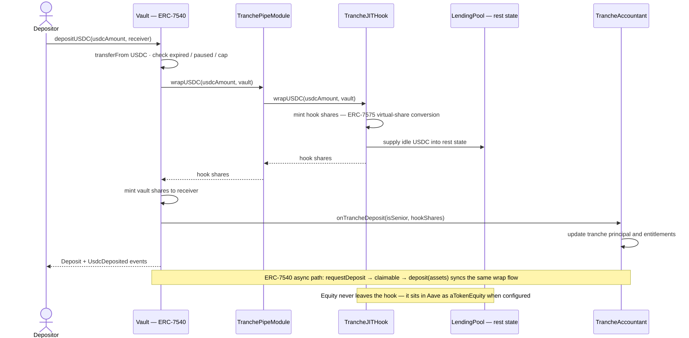

1. User approves USDC and calls `depositUSDC` — vault checks expiry, pause and the deposit cap
   ([`TrancheVault.sol:166`](../src/vaults/TrancheVault.sol#L166)).
2. Vault calls `pipe.wrapUSDC`, which pulls USDC and forwards to the hook
   ([`TranchePipeModule.sol:173`](../src/periphery/TranchePipeModule.sol#L173)).
3. Hook mints ERC-7575 shares with virtual-share conversion and supplies idle USDC to the Aave rest
   state ([`TrancheJITHook.sol:450`](../src/hook/TrancheJITHook.sol#L450)).
4. Vault mints its own ERC-7540 shares to the receiver and notifies the accountant
   (`onTrancheDeposit`), which updates tranche principal and entitlements.
5. Equity legs never leave the hook: they sit in Aave as `aTokenEquity` when configured.

### 4.2 JIT swap lifecycle

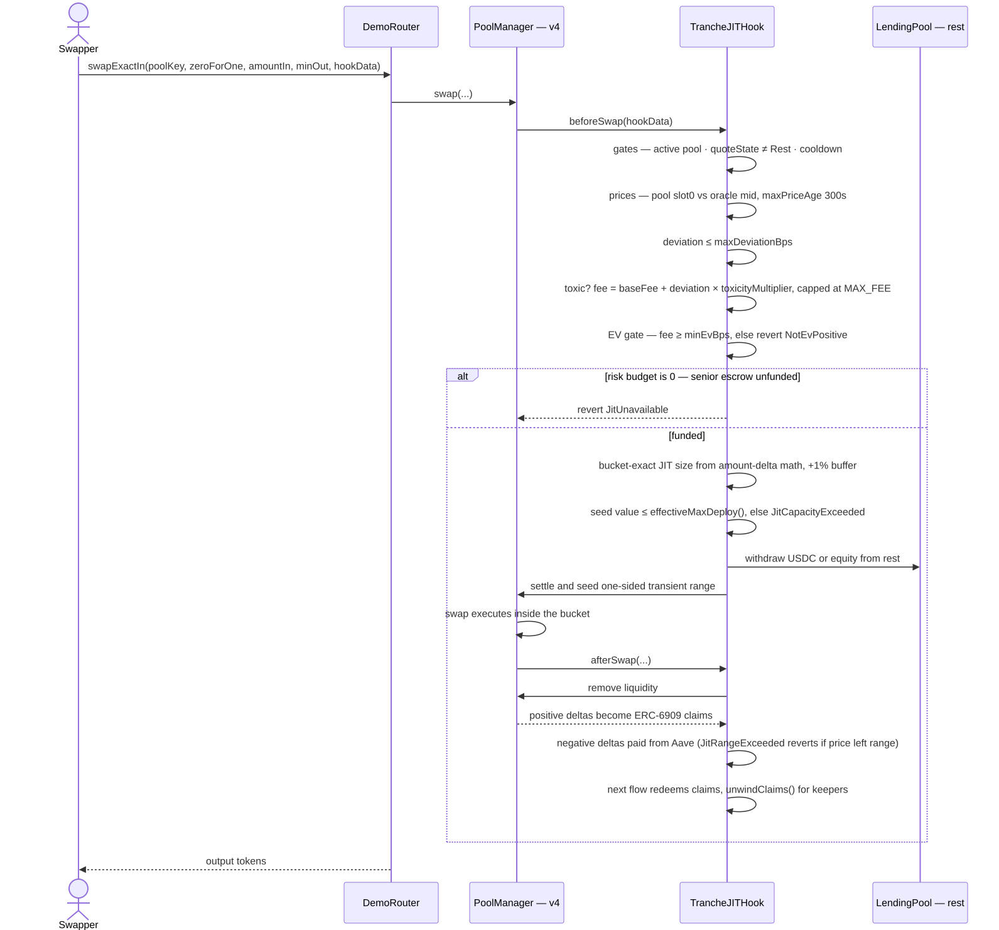

1. Swap enters through `DemoRouter` into the v4 `PoolManager`; the hook's `beforeSwap` runs
   ([`TrancheJITHook.sol:844`](../src/hook/TrancheJITHook.sol#L844)).
2. Gates: active pool, `quoteState ≠ Rest` (params TTL / pause / expiry), cooldown, oracle freshness
   (`maxPriceAge`, default 300s), deviation band — see
   [`_quoteWithGates`](../src/hook/TrancheJITHook.sol#L493).
3. Fee: toxic flow is priced as `baseFee + deviation × toxicityMultiplier`, capped at the protocol
   `MAX_FEE`; a fee below `minEvBps` reverts `NotEvPositive`.
4. JIT: bucket-exact size from v4 amount-delta math with a +1% buffer
   ([`_sizeJit`](../src/hook/TrancheJITHook.sol#L615)), capped by `effectiveMaxDeploy()`; unfunded
   escrow ⇒ `JitUnavailable`.
5. The hook withdraws inventory from Aave, settles to the PoolManager, and seeds a one-sided
   transient range ([`_jitBeforeSwap`](../src/hook/TrancheJITHook.sol#L500)).
6. `afterSwap` removes the range; positive deltas become ERC-6909 claims, negative deltas are paid
   from Aave; `JitRangeExceeded` reverts if price left the bucket
   ([`_jitAfterSwap`](../src/hook/TrancheJITHook.sol#L555)).

### 4.3 Redemption

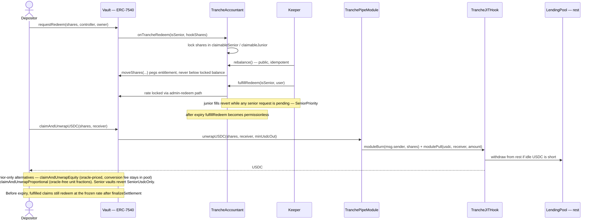

1. `requestRedeem` locks vault shares; the accountant records the claim
   ([`TrancheVault.sol:366`](../src/vaults/TrancheVault.sol#L366)).
2. Anyone can call `rebalance()`; the keeper calls `fulfillRedeem(isSenior, user)`, which locks the
   redemption rate ([`TrancheAccountant.sol:193`](../src/vaults/TrancheAccountant.sol#L193)).
   Junior fills revert while any senior request is pending (`SeniorPriority`).
3. Holder claims in the chosen asset: `claimAndUnwrapUSDC` (both tranches), `claimAndUnwrapEquity` or
   `claimAndUnwrapProportional` (junior only; senior reverts `SeniorUsdcOnly`)
   ([`TrancheVault.sol:291`](../src/vaults/TrancheVault.sol#L291)).
4. The vault calls the pipe (`unwrapUSDC` / `unwrapEquity` / `unwrapProportional`), which burns hook
   shares and pulls the assets — withdrawing from Aave when idle USDC is short.

### 4.4 Maturity settlement

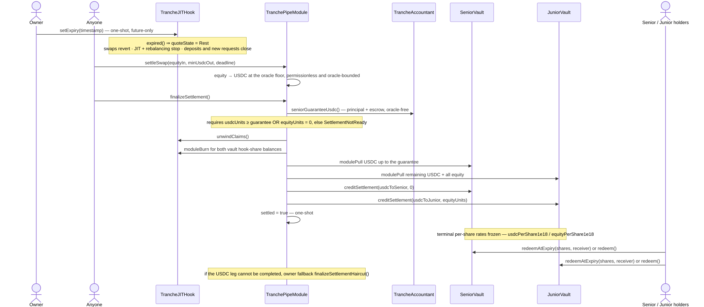

1. Owner calls one-shot, future-only `setExpiry`
   ([`TrancheJITHook.sol:301`](../src/hook/TrancheJITHook.sol#L301)). Once expired:
   `quoteState = Rest`, swaps revert, rebalancing reverts `TradingClosed`, deposits and new withdrawal
   requests close.
2. Anyone can call `settleSwap` to convert equity into USDC at the oracle floor
   ([`TranchePipeModule.sol:289`](../src/periphery/TranchePipeModule.sol#L289)) — permissionless and
   oracle-bounded.
3. Anyone calls `finalizeSettlement` once `usdcUnits ≥ seniorGuaranteeUsdc()` or the equity leg is
   empty ([`TranchePipeModule.sol:319`](../src/periphery/TranchePipeModule.sol#L319)).
4. Waterfall: unwind claims → burn both vaults' hook shares → senior receives USDC up to
   `principal + escrow` → junior receives the remaining USDC plus all equity → each vault freezes
   terminal per-share rates via `creditSettlement`
   ([`TrancheVault.sol:247`](../src/vaults/TrancheVault.sol#L247)).
5. Holders burn shares through `redeemAtExpiry` / `redeem()` at the frozen rates
   ([`TrancheVault.sol:261`](../src/vaults/TrancheVault.sol#L261)).
6. If the USDC leg cannot be completed, the owner fallback is `finalizeSettlementHaircut`
   ([`TranchePipeModule.sol:325`](../src/periphery/TranchePipeModule.sol#L325)).

### 4.5 Agent control loop

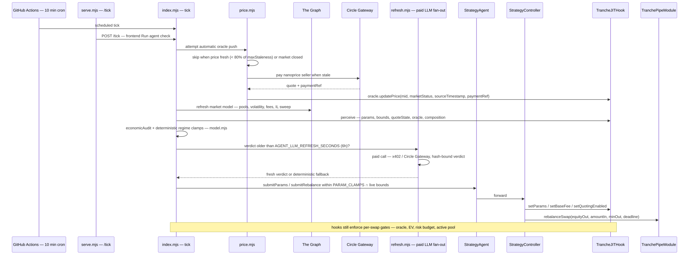

1. GitHub Actions or the local bridge triggers a tick (`POST /tick` from the frontend).
2. The price rail runs first: push only when stale and market open
   ([`agent/price.mjs`](../agent/price.mjs)).
3. Market model refresh (Graph): volatility, fees, active TVL, IL sweep, own-venue stats.
4. `economicAudit` + deterministic regime clamps decide quoting, size and fees
   ([`agent/model.mjs`](../agent/model.mjs)).
5. A paid LLM verdict is refreshed when older than `AGENT_LLM_REFRESH_SECONDS` (6h) and must match
   the market snapshot hash to be trusted ([`agent/refresh.mjs`](../agent/refresh.mjs)).
6. Submissions go through `StrategyAgent` → `StrategyController` (hard bounds) → hook params; the
   hook still enforces per-swap gates.

### 4.6 Price oracle — x402 → Circle Gateway

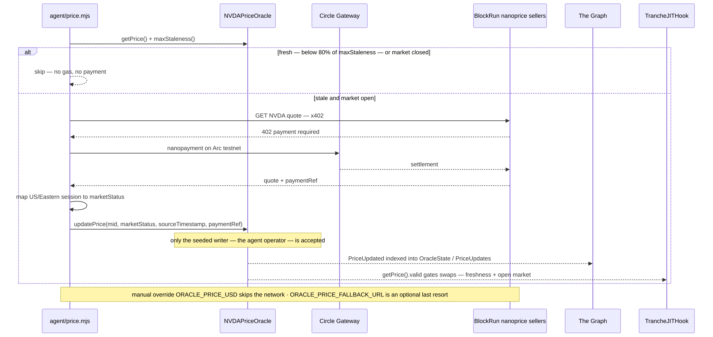

1. Agent reads `getPrice()` and `maxStaleness()`; fresh prices (< 80% of staleness) and closed
   markets are skipped — no gas, no payment.
2. When stale, the agent requests a quote from the seller list (`ORACLE_PRICE_SELLERS`), pays the
   402 challenge exclusively via Circle Gateway nanopayments, and receives the quote plus a
   `paymentRef`.
3. The US/Eastern session is mapped to `marketStatus` and published with `updatePrice`
   ([`NVDAPriceOracle.sol:106`](../src/oracle/NVDAPriceOracle.sol#L106)); only the seeded writer (the
   agent operator) is accepted.
4. `PriceUpdated` is indexed by the subgraph; hook gates read `getPrice().valid` (freshness + open
   market).

### 4.7 Rebalancing rails

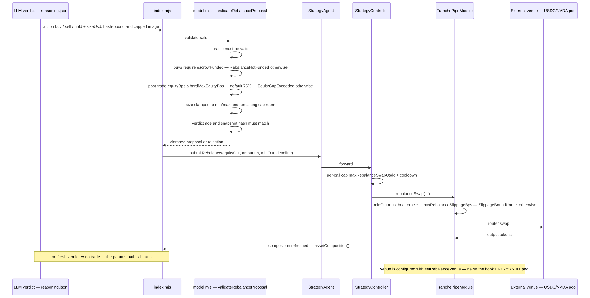

1. The LLM proposes `buy` / `sell` / `hold` + size; `validateRebalanceProposal` enforces the rails:
   valid oracle, escrow funded for buys, post-trade equity ≤ `hardMaxEquityBps` (default 75%), size
   within min/max and remaining cap room, freshness + hash match.
2. `StrategyAgent.submitRebalance` → `StrategyController` applies the per-call cap and cooldown
   ([`StrategyController.sol:165`](../src/strategy/StrategyController.sol#L165)).
3. `TranchePipeModule.rebalanceSwap` enforces `minOut` against the oracle minus
   `maxRebalanceSlippageBps` and swaps at the configured external venue
   ([`TranchePipeModule.sol:245`](../src/periphery/TranchePipeModule.sol#L245)).
4. No fresh verdict means no trade; the params path still runs. The venue is never the hook's own JIT
   pool.

---

## 5. Hook quote state machine


| State | Condition | Size |
|---|---|---|
| ACTIVE | `now ≤ paramsUpdatedAt + ttl` | `min(maxDeployPerSwap, riskBudget)` |
| DEGRADED | within `ttl + gracePeriod` | `min(maxDeployPerSwap / 4, riskBudget)` |
| REST | paused, quoting off, pool unset, past grace, or expired | `0` — capital stays in Aave |

`riskBudget = juniorClaim` only while `accountant.escrowFunded()`, else `0`. Once expired, REST is
terminal: swaps revert `QuotingOff` and rebalancing reverts `TradingClosed`.

---

## 6. Regenerating the diagrams

```bash
# With a system browser (skips the Chromium download):
#   PowerShell: $env:PUPPETEER_EXECUTABLE_PATH = "C:\Program Files\Google\Chrome\Application\chrome.exe"
#   bash:       export PUPPETEER_EXECUTABLE_PATH="/usr/bin/google-chrome"
npm run diagrams:export
```

Sources live in `docs/diagrams/`, exports land in `docs/assets/`; both are committed so GitHub and
presentations always render the same picture as the code.
