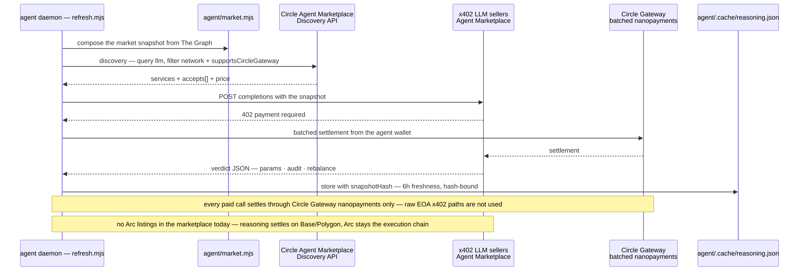

# Architecture — integration deep dive

The tranche stack is built around four integrations. Each one does a job in the product and gets a
code-pointed section below:

| # | Integration | Job in the product | Where |
|---|---|---|---|
| 1 | **Uniswap v4 hook** | `TrancheJITHook` is the execution engine: dynamic fee, quote gates and bucket-exact JIT liquidity inside the v4 `PoolManager` | §2 · `src/hook/TrancheJITHook.sol` |
| 2 | **ERC-7575 hook share** | `HookShareToken` is the tranche primitive: one basket-backed share (USDC + equity) that both ERC-7540 vaults wrap and exit through | §3 · `src/core/HookShareToken.sol` |
| 3 | **The Graph** | `tranch-stock` subgraph indexes prices, swaps, JIT episodes, tranche flows and agent actions; the agent market model and the frontend Markets page read it | §4 · `subgraph/` |
| 4 | **Circle marketplace** | Agent Marketplace discovery + Circle Gateway nanopayments pay for the NVDA quote and the LLM verdict; passkey wallets + paymaster host the frontend | §5 · `agent/price.mjs`, `scripts/agent-market.mjs` |

Diagrams are authored in Mermaid (`docs/diagrams/*.mmd`), exported to SVG (`docs/assets/*.svg`,
`npm run diagrams:export`), and both are committed. Contracts and scripts are linked with line
numbers so reviewers can verify each claim in the source. Addresses
are never embedded here: read them from `deployments/arc-testnet.json` (regenerated by
`npm run export:pack`).

---

## 1. System overview


Pillar legend: hook (orange), ERC-7575 share (blue), The Graph (violet), Circle marketplace (green).

| Layer | Component | Responsibility | Pillar | Source |
|---|---|---|---|---|
| Apps | Frontend | Vaults / Price / Strategy / Markets pages; injected wallet or Circle passkey smart account with `paymaster: true` | Circle | `frontend/src/main.ts`, `frontend/src/wallet.ts` |
| Apps | Agent daemon | Tick loop: perceive → economic audit → submit params / rebalance; owns the oracle price rail | Circle | `agent/index.mjs`, `agent/model.mjs` |
| Apps | Agent HTTP bridge | `POST /tick`, `GET /health` for the frontend "Run agent check" button | — | `agent/serve.mjs` |
| Apps | Heartbeat | GitHub Actions cron (every 10 min) runs the tick and refreshes the paid verdict | — | `.github/workflows/agent-heartbeat.yml` |
| Apps | Static site | GitHub Pages deploy of `frontend/dist` on every push to `main` | — | `.github/workflows/pages.yml` |
| Tranche core | `TrancheJITHook` | Dynamic fee, quote gates, bucket-exact JIT, Aave rest state, one-shot expiry | Hook | `src/hook/TrancheJITHook.sol` |
| Tranche core | `HookShareToken` | ERC-7575 share for the hook strategy receipt (mint/burn by hook only) | 7575 | `src/core/HookShareToken.sol` |
| Tranche core | `TranchePipeModule` | Dual-token exits, venue rebalancing, maturity settlement waterfall | 7575 | `src/periphery/TranchePipeModule.sol` |
| Tranche core | `SeniorVault` / `JuniorVault` | ERC-7540 async vaults over the hook share; senior USDC-only exits | 7575 | `src/vaults/SeniorVault.sol`, `src/vaults/JuniorVault.sol`, `src/vaults/TrancheVault.sol` |
| Tranche core | `TrancheAccountant` | Senior/junior entitlements, escrow, senior-priority keeper, frozen settlement credits | 7575 | `src/vaults/TrancheAccountant.sol` |
| Tranche core | `StrategyController` / `StrategyAgent` | Hard bounds for the operator key; agent can only reshape activity within caps | — | `src/strategy/StrategyController.sol`, `src/strategy/StrategyAgent.sol` |
| Markets | Uniswap v4 instance | Canonical v4-core + v4-periphery code (pinned submodules, unmodified) redeployed on Arc testnet; `DemoRouter` is ours | Hook | `lib/v4-core`, `lib/v4-periphery`, `src/router/DemoRouter.sol` |
| Markets | Aave V2 semi-fork | Rest state: USDC + NVDA markets, aTokens, pegged oracle; independent implementation (no upstream code copied) | Hook | `src/lending/` |
| Markets | `NVDAPriceOracle` | x402-pushed NVDA/USD price; gates hook quoting and lending pegs | Circle | `src/oracle/NVDAPriceOracle.sol` |
| External | The Graph | `tranch-stock` subgraph indexes oracle, pools, hook, strategy and tranche events; gateway powers the market model and the frontend Markets page | Graph | `subgraph/`, `agent/graph.mjs` |
| External | Circle Gateway | Batched nanopayments for the NVDA quote and the paid LLM verdict | Circle | `agent/price.mjs`, `scripts/agent-market.mjs` |
| External | Circle Wallets | Passkey smart accounts + paymaster (`paymaster: true`) for the hosted frontend | Circle | `frontend/src/wallet.ts` |
| External | x402 sellers | Agent Marketplace LLM services and NVDA stock quote sellers | Circle | `agent/price.mjs`, `scripts/agent-market.mjs` |

---

## 2. Hook integration — `TrancheJITHook` inside Uniswap v4


The hook is the only bridge between the tranche stack and the two markets: **rest state** = Aave V2
semi-fork (`deposit`/`withdraw` USDC via `IAaveV2Pool`), **execution** = v4 (dynamic fee + JIT). The
venue pool carries **zero standing liquidity**: inventory sits in Aave until a swap arrives, then a
one-sided transient position is seeded for exactly the bucket the swap trades into and removed in
`afterSwap`.

### Callback surface

| Callback | What it does | Code |
|---|---|---|
| `getHookPermissions` | `beforeInitialize`, `beforeAddLiquidity`, `beforeRemoveLiquidity`, `beforeSwap`, `afterSwap` — no custom-accounting return-delta flags (the hook never mutates swap deltas) | [`207`](../src/hook/TrancheJITHook.sol#L207) |
| `_beforeSwap` | active-pool check → gate stack → fee priced → JIT range sized, seeded and settled to the PoolManager | [`844`](../src/hook/TrancheJITHook.sol#L844) |
| `_afterSwap` | removes the transient range; positive deltas become ERC-6909 claims, negative deltas are paid from Aave; `JitRangeExceeded` reverts if price left the bucket | [`860`](../src/hook/TrancheJITHook.sol#L860) |

### Gate stack (every swap)

| Gate | Rule | Failure |
|---|---|---|
| Active pool | only the configured `poolId`, `hooks == this` | `InactivePool` |
| Quote state | `quoteState() != Rest` — params TTL, pause, quoting flag, expiry | `QuotingOff` |
| Cooldown | minimum interval between quotes | cooldown revert |
| Oracle freshness | `now − updatedAt ≤ maxPriceAge` (default 300s) on top of the oracle's own staleness | stale quote refused |
| Deviation band | `deviationBps = \|pool − oracle\| / oracle ≤ maxDeviationBps` | `DeviationTooHigh` |
| EV floor | quoted fee `≥ minEvBps × 100` | `NotEvPositive` |
| Risk budget | JIT enabled and `effectiveMaxDeploy() > 0` | `JitUnavailable` |

Fee: non-toxic flow pays `baseFee`; toxic flow (pushes the pool price **toward** the oracle) pays
`min(baseFee + deviationBps × toxicityMultiplierBps, 1_000_000)`. JIT sizing is **bucket-exact** —
solved from v4's amount-delta equations for the single one-sided bucket (+1% rounding buffer) —
valued at the oracle and capped by [`effectiveMaxDeploy`](../src/hook/TrancheJITHook.sol#L400) /
[`_sizeJit`](../src/hook/TrancheJITHook.sol#L615). Oversized swaps revert `JitCapacityExceeded`
rather than letting the AMM run with thin liquidity.

### Quote state machine


| State | Condition | Behavior |
|---|---|---|
| ACTIVE | `now ≤ paramsUpdatedAt + ttl` | full quoting, `effectiveMaxDeploy = min(maxDeployPerSwap, riskBudget)` |
| DEGRADED | within `ttl + gracePeriod` | reduced size, capped at `maxDeployPerSwap / 4` |
| REST | paused, quoting off, pool unset, past grace, or expired | no quotes — capital stays in Aave |

`riskBudget = juniorClaim` only while `accountant.escrowFunded()` — an unfunded senior escrow turns
JIT off automatically. `setExpiry` is one-shot and future-only; after maturity REST is terminal:
swaps revert `QuotingOff`, rebalancing through the pipe reverts `TradingClosed`, and only settlement
paths remain ([`301`](../src/hook/TrancheJITHook.sol#L301)).

### Hook code map

| Function | Role | Line |
|---|---|---|
| `getHookPermissions` | callback surface | [`207`](../src/hook/TrancheJITHook.sol#L207) |
| `setExpiry` | one-shot maturity | [`301`](../src/hook/TrancheJITHook.sol#L301) |
| `effectiveMaxDeploy` | risk-budget cap | [`400`](../src/hook/TrancheJITHook.sol#L400) |
| `wrapUSDC` / `unwrapUSDC` | share pipe | [`450`](../src/hook/TrancheJITHook.sol#L450) / [`463`](../src/hook/TrancheJITHook.sol#L463) |
| `_quoteWithGates` | gate stack | [`493`](../src/hook/TrancheJITHook.sol#L493) |
| `_jitBeforeSwap` / `_jitAfterSwap` / `_sizeJit` | JIT engine | [`500`](../src/hook/TrancheJITHook.sol#L500) / [`555`](../src/hook/TrancheJITHook.sol#L555) / [`615`](../src/hook/TrancheJITHook.sol#L615) |
| `_beforeSwap` / `_afterSwap` | IHooks entry points | [`844`](../src/hook/TrancheJITHook.sol#L844) / [`860`](../src/hook/TrancheJITHook.sol#L860) |

Safety notes: virtual shares/assets for inflation defense; `wrapUSDC` / `unwrapUSDC` /
`seedInventory` / `unwindClaims` are `nonReentrant`; `unwindClaims()` is intentionally
permissionless (it only moves hook-owned claims to Aave). Full module notes: `docs/HOOK.md`.

---

## 3. ERC-7575 hook-share integration



Both tranche vaults wrap the **same** ERC-7575 share. The token is an ERC-20 whose
`vault(address asset)` reports the hook as the vault for its asset — the ERC-7575 surface — and
mint/burn are restricted to the hook, so the share supply is always backed by the hook's basket
(USDC resting in Aave + equity inventory) ([`HookShareToken.sol`](../src/core/HookShareToken.sol#L25),
interface `IHookShareToken`).

| Actor | Call | Result |
|---|---|---|
| Depositor | `depositUSDC` on a vault | vault → pipe `wrapUSDC` → hook mints 7575 shares and supplies idle USDC to Aave; vault mints its ERC-7540 shares ([`166`](../src/vaults/TrancheVault.sol#L166), [`173`](../src/periphery/TranchePipeModule.sol#L173), [`450`](../src/hook/TrancheJITHook.sol#L450)) |
| Redeemer | `requestRedeem` then `claimAndUnwrap…` | the pipe burns 7575 shares and the basket pays out in the chosen asset ([`366`](../src/vaults/TrancheVault.sol#L366), [`291`](../src/vaults/TrancheVault.sol#L291), [`310`](../src/vaults/TrancheVault.sol#L310), [`330`](../src/vaults/TrancheVault.sol#L330)) |
| Accountant | `rebalance()` → `moveShares` | pegs each vault's 7575 balance to its entitlement without stripping the assets backing unclaimed redemptions ([`162`](../src/vaults/TrancheAccountant.sol#L162)) |
| Keeper | `fulfillRedeem(bool senior, address user)` | locks the redemption rate; junior fills revert while any senior request is pending (`SeniorPriority`) ([`193`](../src/vaults/TrancheAccountant.sol#L193)) |

Exit paths (the pipe burns 7575 shares — [`wrapUSDC`](../src/periphery/TranchePipeModule.sol#L173),
[`unwrapUSDC`](../src/periphery/TranchePipeModule.sol#L187),
[`unwrapEquity`](../src/periphery/TranchePipeModule.sol#L201),
[`unwrapProportional`](../src/periphery/TranchePipeModule.sol#L217)):

| Path | Pricing | Who |
|---|---|---|
| USDC | share NAV; withdraws from the Aave rest state | senior + junior |
| Equity in-kind | oracle mid with `maxPriceAge` enforced; conversion fee (`conversionFeeBps ≤ 100`) stays in the pool | junior only — senior reverts `SeniorUsdcOnly` |
| Proportional | oracle-free unit fractions of idle + Aave balances | junior only |

The accountant turns flows into entitlements (`seniorClaim`, `juniorClaim`, escrow gate) and values
the basket through `hook.convertToUsdc()`; rules and formulas live in `docs/ACCOUNTANT.md`.

---

## 4. The Graph integration



The `tranch-stock` subgraph is the protocol's **speed layer**. Security-sensitive reads (swaps,
redemptions, hook gates) still go to Arc RPC — the subgraph is never the trust layer, only the
frontend/agent read path.

Data sources (addresses are never hand-edited: `npm run subgraph:sync`, verify with `--check`):

| Source | Events indexed |
|---|---|
| `NVDAPriceOracle` | `PriceUpdated` (mid/bid/ask, session, writer, `paymentRef`), `MarketStatusUpdated` |
| `PoolManager` | pool `Initialize`, every `Swap` |
| `TrancheJITHook` | params/base-fee/quoting, `SwapQuoted`, `JitDeployed`/`JitRemoved`, claim redemptions, share wraps/unwraps, Aave supply/withdraw, inventory seeding, wiring updates |
| `StrategyController` / `StrategyAgent` | agent submissions with the full params snapshot |
| `SeniorVault` / `JuniorVault` | deposits, unwraps, share moves, pause/cap changes |
| `TrancheAccountant` | deposit/redeem reports, rebalances, redemption fulfilments |

The schema vendors the **Messari Yield Aggregator v1.3.1** standard (`vaults`, `deposits`,
`withdraws`, TVL snapshots), so cross-protocol queries run unchanged, and keeps protocol extensions
(`HookState`, `Quote`, `JitDeployment`, `ShareFlow`, `AgentAction`, `AccountantReport`, …) that
power the agent and the UI.

Consumers:

- **Agent market model** — `agent/market.mjs` reads volatility, fees, active TVL and the fee-vs-IL
  sweep; the resulting snapshot hash binds the paid LLM verdict (§5).
- **Frontend Markets page** — NVDAc pool stats through the Graph gateway, never the Arc venue pool.
- **Subgraph MCP** — natural-language cross-protocol analysis (`docs/MCP.md`).

Query access: keyless Studio URL for dev, Graph API key for production, or an x402-paid gateway —
which matches the product's own payment rail. Fallback policy: subgraph → direct RPC reads; a
transaction is never gated on subgraph data alone. Full query cookbook: `docs/GRAPH.md`.

---

## 5. Circle marketplace integration



**Rail policy:** every paid call in the product settles through **Circle Gateway batched settlement
(nanopayments)**. Raw EOA x402 paths are legacy and are not used in product flows.

### Paid reasoning loop (the LLM strategy manager)

1. `npm run circle:discover` — the Circle Agent Marketplace Discovery API (free, no auth) lists x402
   LLM services; the agent filters by network and `supportsCircleGateway`
   ([`agent-market.mjs`](../scripts/agent-market.mjs)).
2. `npm run circle:inspect` — shows the service's 402 challenge.
3. `npm run circle:reason` — pays per call from the Circle agent wallet via Gateway, then stores the
   verdict in `agent/.cache/reasoning.json` with the Graph `snapshotHash`.
4. The daemon trusts the verdict only while it is fresh (6h) and its hash matches the current market
   snapshot ([`refresh.mjs`](../agent/refresh.mjs)); deterministic clamps and onchain bounds always
   apply afterwards.

### Price rail — x402 quote → onchain oracle


1. `agent/price.mjs` reads `getPrice()` + `maxStaleness()`; fresh prices (< 80% of staleness) and
   closed markets are skipped — no gas, no payment.
2. When stale, the seller list (`ORACLE_PRICE_SELLERS`) is tried in order; a 402 response is paid
   **only** if it offers a Circle Gateway batched option (`isBatchPayment`), within the per-call cap
   ([`price.mjs`](../agent/price.mjs)).
3. The quote is mapped to the US/Eastern session and published with `updatePrice(...)`
   ([`106`](../src/oracle/NVDAPriceOracle.sol#L106)); only the seeded writer (the agent operator) is
   accepted, and the `paymentRef` anchors the payment to the onchain update.
4. The subgraph indexes `PriceUpdated`; hook gates read `getPrice().valid`.

Seller errors are sanitized — third-party data-provider names never surface (`friendlyError`). The
public fallback URL exists only as an explicit `ORACLE_PRICE_FALLBACK_URL` opt-in; there is no
default public fallback.

### Wallets and sponsorship (frontend)

`frontend/src/wallet.ts` connects an injected browser wallet or a Circle passkey smart account
(Create / Unlock); userOps submit with `paymaster: true`, so Arc testnet flows are gasless. The
hosted site injects `VITE_CLIENT_KEY` at build time; domain setup table in `docs/CIRCLE.md`.

### Circle product map

| Circle product | Where | Status |
|---|---|---|
| Arc + USDC | contracts, gas, accounting (tranches, lending rest, JIT hook, NVDA pool) | live on Arc testnet |
| Agent Marketplace Discovery API | `scripts/agent-market.mjs --search` picks the LLM service by network / price / rails | working (no auth) |
| Nanopayment for AI reasoning | `circle:reason` pays the selected service per call through Gateway with the Graph snapshot | working — verified |
| Circle Wallets (passkey) | frontend Create / Unlock; injected wallet fallback | implemented |
| Paymaster / Gas Station | userOps with `paymaster: true` | implemented (testnet sponsorship) |

---

## 6. End-to-end flows

### 6.1 Deposit → rest state


1. User approves USDC and calls `depositUSDC` — the vault checks expiry, pause and the deposit cap
   ([`TrancheVault.sol:166`](../src/vaults/TrancheVault.sol#L166)).
2. The vault calls `pipe.wrapUSDC`, which pulls USDC and forwards to the hook
   ([`TranchePipeModule.sol:173`](../src/periphery/TranchePipeModule.sol#L173)).
3. The hook mints ERC-7575 shares with virtual-share conversion and supplies idle USDC to the Aave
   rest state ([`TrancheJITHook.sol:450`](../src/hook/TrancheJITHook.sol#L450)).
4. The vault mints its own ERC-7540 shares to the receiver and notifies the accountant
   (`onTrancheDeposit`), which updates tranche principal and entitlements.
5. Equity legs never leave the hook: they sit in Aave as `aTokenEquity` when configured.

### 6.2 Redemption


1. `requestRedeem` locks vault shares; the accountant records the claim
   ([`TrancheVault.sol:366`](../src/vaults/TrancheVault.sol#L366)).
2. Anyone can call `rebalance()`; the keeper calls `fulfillRedeem(isSenior, user)`, which locks the
   redemption rate ([`TrancheAccountant.sol:193`](../src/vaults/TrancheAccountant.sol#L193)).
   Junior fills revert while any senior request is pending (`SeniorPriority`).
3. The holder claims in the chosen asset: `claimAndUnwrapUSDC` (both tranches),
   `claimAndUnwrapEquity` or `claimAndUnwrapProportional` (junior only; senior reverts
   `SeniorUsdcOnly`) ([`TrancheVault.sol:291`](../src/vaults/TrancheVault.sol#L291)).
4. The vault calls the pipe (`unwrapUSDC` / `unwrapEquity` / `unwrapProportional`), which burns hook
   shares and pulls the assets — withdrawing from Aave when idle USDC is short.

### 6.3 Maturity settlement


1. The owner calls one-shot, future-only `setExpiry`
   ([`TrancheJITHook.sol:301`](../src/hook/TrancheJITHook.sol#L301)). Once expired: `quoteState =
   Rest`, swaps revert, rebalancing reverts `TradingClosed`, deposits and new withdrawal requests
   close.
2. Anyone calls `settleSwap` to convert equity into USDC at the oracle floor
   ([`TranchePipeModule.sol:289`](../src/periphery/TranchePipeModule.sol#L289)) — permissionless and
   oracle-bounded.
3. Anyone calls `finalizeSettlement` once `usdcUnits ≥ seniorGuaranteeUsdc()` or the equity leg is
   empty ([`TranchePipeModule.sol:319`](../src/periphery/TranchePipeModule.sol#L319)).
4. Waterfall: unwind claims → burn both vaults' hook shares → senior receives USDC up to
   `principal + escrow` → junior receives the remaining USDC plus all equity → each vault freezes
   terminal per-share rates via `creditSettlement`
   ([`TrancheVault.sol:247`](../src/vaults/TrancheVault.sol#L247)).
5. Holders burn shares through `redeemAtExpiry` / `redeem()` at the frozen rates
   ([`TrancheVault.sol:261`](../src/vaults/TrancheVault.sol#L261)).
6. If the USDC leg cannot be completed, the owner fallback is `finalizeSettlementHaircut`
   ([`TranchePipeModule.sol:325`](../src/periphery/TranchePipeModule.sol#L325)).

### 6.4 Agent control loop


1. GitHub Actions or the local bridge triggers a tick (`POST /tick` from the frontend).
2. The price rail runs first (gates + Gateway payment — §5).
3. Market model refresh (The Graph — §4): volatility, fees, active TVL, IL sweep, own-venue stats.
4. `economicAudit` + deterministic regime clamps decide quoting, size and fees
   ([`agent/model.mjs`](../agent/model.mjs)).
5. A paid LLM verdict is refreshed when older than `AGENT_LLM_REFRESH_SECONDS` (6h) and must match
   the market snapshot hash to be trusted ([`agent/refresh.mjs`](../agent/refresh.mjs)).
6. Submissions go through `StrategyAgent` → `StrategyController` (hard bounds) → hook params; the
   hook still enforces per-swap gates (§2).

### 6.5 Rebalancing rails


1. The LLM proposes `buy` / `sell` / `hold` + size; `validateRebalanceProposal` enforces the rails:
   valid oracle, escrow funded for buys, post-trade equity ≤ `hardMaxEquityBps` (default 75%), size
   within min/max and remaining cap room, freshness + hash match.
2. `StrategyAgent.submitRebalance` → `StrategyController` applies the per-call cap and cooldown
   ([`StrategyController.sol:165`](../src/strategy/StrategyController.sol#L165)).
3. `TranchePipeModule.rebalanceSwap` enforces `minOut` against the oracle minus
   `maxRebalanceSlippageBps` and swaps at the configured external venue
   ([`TranchePipeModule.sol:245`](../src/periphery/TranchePipeModule.sol#L245)).
4. No fresh verdict means no trade; the params path still runs. The venue is never the hook's own JIT
   pool.

---

## 7. Application stack — frontend + backend


**Frontend** (`frontend/`, Vite + TypeScript, no framework):

| Page / module | Behavior | Source |
|---|---|---|
| Vaults | USDC deposits (`depositUSDC`), redeem requests, keeper fulfill, claims in USDC / equity / proportional | `frontend/src/main.ts` |
| Price | Oracle mid/bid/ask, market session, staleness, writer | `frontend/src/main.ts` |
| Strategy | `StrategyController` bounds + hook params; "Run agent check" calls the bridge | `frontend/src/main.ts` |
| Markets | NVDAc pool stats read through The Graph gateway (never the Arc venue pool) | `frontend/src/main.ts` |
| Wallet | Injected browser wallet or Circle passkey smart account; userOps with `paymaster: true` | `frontend/src/wallet.ts` |
| Config | Manifest + ABIs from the frontend pack | `frontend/src/config.ts`, `deployments/arc-testnet.json`, `docs/abis/` |

**Backend** (`agent/`, Node; no server dependency):

| Module | Responsibility | Source |
|---|---|---|
| Tick loop | Load env, check oracle freshness, push price, perceive, audit, act | `agent/index.mjs` |
| Price rail | Skip when fresh (< 80% of `maxStaleness`) or market closed; pay seller via Circle Gateway; `updatePrice` | `agent/price.mjs` |
| Market model | Graph-only: volatility, fees, active TVL, fee-vs-IL sweep, own-venue stats | `agent/market.mjs` |
| Model | Range math, `economicAudit`, clamps, `validateRebalanceProposal` | `agent/model.mjs` |
| Paid manager | 6h LLM verdict bound to the market snapshot hash | `agent/refresh.mjs`, `agent/ai-prompt.mjs`, `scripts/agent-market.mjs` |
| HTTP bridge | `POST /tick`, `GET /health` (dry-run unless `--submit`) | `agent/serve.mjs` |

---

## 8. Deployment topology


| Chain / service | Role |
|---|---|
| Arc testnet (`eip155:5042002`) | All protocol contracts, frontend, agent daemon, heartbeat |
| Base mainnet (`eip155:8453`) | Circle agent wallet — USDC funding source for Gateway |
| Polygon (`eip155:137`) | Agent Marketplace x402 reasoning settlement |
| The Graph | `tranch-stock` subgraph (Arc) + gateway queries |
| Circle Gateway | Batched nanopayments; testnet facilitator `gateway-api-testnet.circle.com` |

The deployment manifest (`deployments/arc-testnet.json`) is the single source of truth for
addresses; the subgraph sources are synced from it. Deployment status and checklists live in
`docs/DEPLOYMENTS.md`.

---

## 9. Regenerating the diagrams

```bash
# With a system browser (skips the Chromium download):
#   PowerShell: $env:PUPPETEER_EXECUTABLE_PATH = "C:\Program Files\Google\Chrome\Application\chrome.exe"
#   bash:       export PUPPETEER_EXECUTABLE_PATH="/usr/bin/google-chrome"
npm run diagrams:export
```

Sources live in `docs/diagrams/`, exports land in `docs/assets/`; both are committed so GitHub and
presentations always render the same picture as the code.
